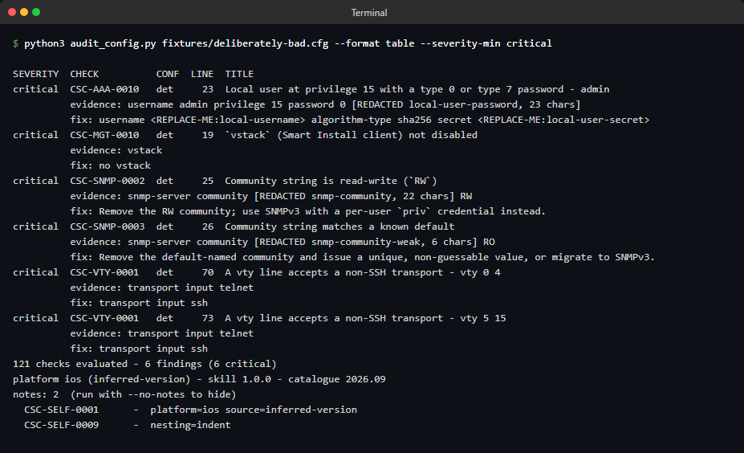
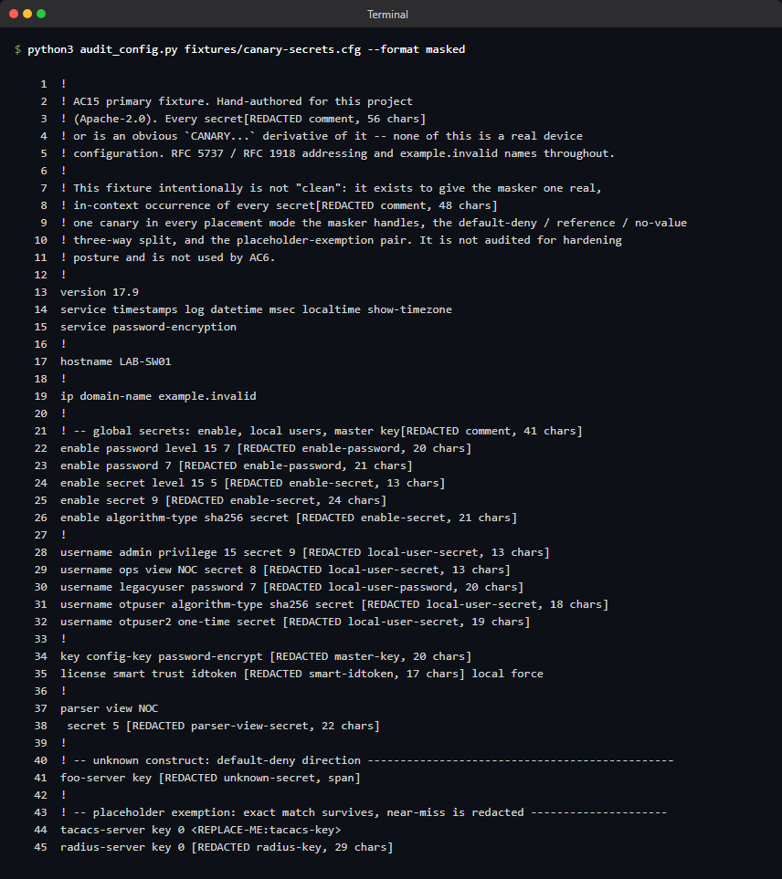
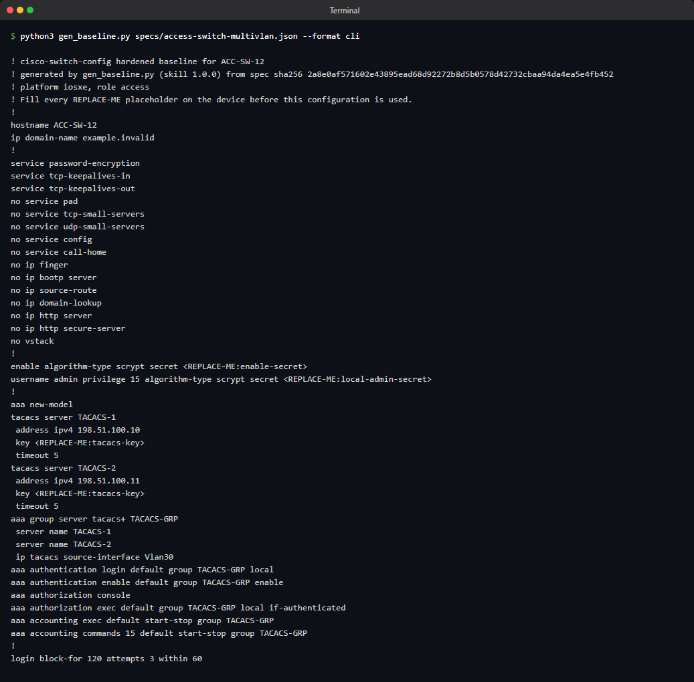

# Study Cisco Switch Config

A Claude skill that audits Cisco IOS / IOS-XE switch running-configurations for security and
reliability defects, entirely offline, and generates hardened baseline configurations from a
short spec.

*by Hans Study — [hans.study/tools/cisco-switch-config/](https://hans.study/tools/cisco-switch-config/)*

[](https://github.com/hansstudy/cisco-switch-config/releases/latest)
[](https://github.com/hansstudy/cisco-switch-config/blob/main/LICENSE)
[](https://github.com/hansstudy/cisco-switch-config/actions/workflows/ci.yml)
[](https://github.com/hansstudy/cisco-switch-config/releases)
[](https://hans.study/tools/cisco-switch-config/)

## What problem this solves

Reviewing a Cisco switch running-config by eye is slow and inconsistent, and pasting one into a
general-purpose chat model gets you plausible-sounding advice with no repeatable basis. This
skill runs a deterministic, stdlib-only Python engine over the pasted text: every finding carries
a severity, the masked evidence line, paste-ready remediation, and a citation to DISA STIG, NSA,
CISA or Cisco guidance (CIS Benchmarks are cited by ID only, never copied). It can also generate a
hardened baseline configuration from a short spec, and diff two configs to show what changed and
which hardening controls a change crossed.

## Install

```
/plugin marketplace add hansstudy/cisco-switch-config
/plugin install cisco-switch-config@hansstudy-cisco
```

See [`docs/install.md`](docs/install.md) for the other two surfaces (a manual `.zip` install on
claude.ai, and the Claude API's `skills.create`).

## Usage

Paste a `show running-config` (or point at a file) and ask, for example: "Audit this Cisco switch
config for security issues." The skill also answers "generate a hardened baseline for a 48-port
Catalyst access switch with VLANs 10/20/99" and "what changed between these two configs, and does
it matter?"

## Screenshots

All of these are real runs of the CLI engine against the synthetic fixtures in
`tests/fixtures/synthetic/`; nothing shown is a real device configuration.


*`--format table` against a deliberately unhardened fixture, filtered to critical findings.*


*`--format masked`: every secret-bearing line replaced with a `[REDACTED ...]` placeholder.*


*A hardened baseline generated from a VLAN spec, `REPLACE-ME` placeholders left for site secrets.*

Demo recording: [`docs/screenshots/demo.gif`](docs/screenshots/demo.gif).

## Requirements

- Runs entirely inside the invoking surface (Claude Code, claude.ai, or the Claude API's code
  execution tool). Python 3.11+, standard library only — nothing to install.
- No credentials, no device access, and no network connection of any kind. The tool never
  connects to a switch; it reads text you provide.

## Verify this download

Every release ships a `SHA256SUMS` file and a Sigstore build-provenance attestation. See
[`docs/verify-downloads.md`](docs/verify-downloads.md) for the exact `Get-FileHash` and
`gh attestation verify` commands. This artifact is not Authenticode-signed (see that doc for why
and what that means for Windows SmartScreen).

## Landing page

[https://hans.study/tools/cisco-switch-config/](https://hans.study/tools/cisco-switch-config/)

## Security

See [`SECURITY.md`](https://github.com/hansstudy/.github/blob/main/SECURITY.md) (inherited from
the account-level `.github` repo; no override in this repo). Report vulnerabilities privately via
GitHub private vulnerability reporting or [bugs@hans.study](mailto:bugs@hans.study), never in a public
issue.

## Trademark and CIS disclaimer

Cisco, Catalyst, IOS, IOS-XE and NX-OS are trademarks of Cisco Systems, Inc. CIS and CIS
Benchmarks are trademarks of the Center for Internet Security. This project is independent: this
tool is not a CIS Benchmark and is not affiliated with or endorsed by Cisco, CIS, DISA, NSA or
CISA. Findings are advisory and do not constitute a compliance attestation. See
[`TRADEMARKS.md`](TRADEMARKS.md).

## Third-party content

This repo's licence covers only material Hans Study authored. See
[`docs/content-provenance.md`](docs/content-provenance.md) for what third-party content this
project references and under what terms — in short: DISA STIG / NSA / CISA rule text may be
quoted verbatim (public domain), CIS Benchmark content is cited by ID and section only and never
copied, and a handful of Apache-2.0 fixture configs are embedded verbatim with attribution.

## Telemetry

This tool collects no telemetry. It does not phone home, does not call any analytics endpoint,
and does not transmit anything about its use to anyone, including the maintainer. Everything it
produces stays on the machine (or the session) it ran in.

## Support

This is published as working software, not as a supported product. Issues and pull requests are
read and are usually answered within a week. There is no SLA. If you need this run, tuned, or
backed by a person, that is consulting work - [start here](https://hans.study/start-an-engagement/).

## Licence

Apache-2.0. See [`LICENSE`](LICENSE) and [`NOTICE`](NOTICE).
